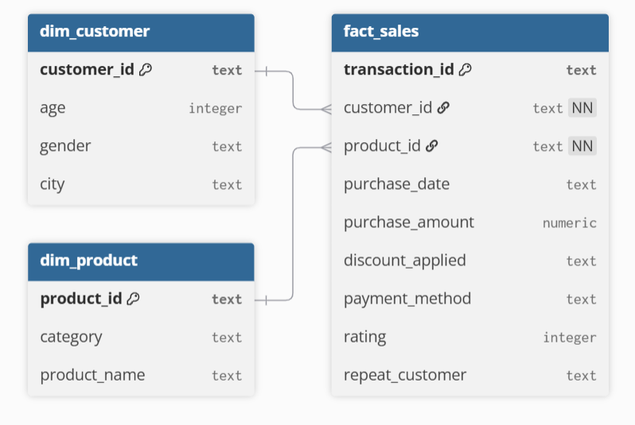
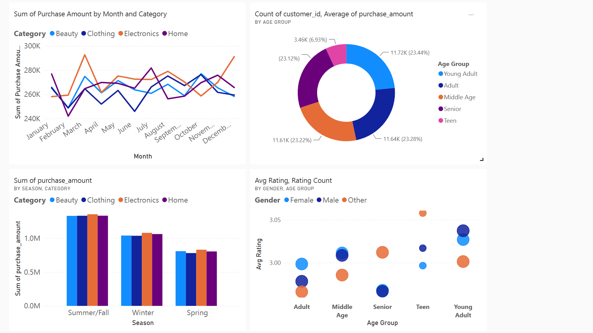

# Walmart_Sales_Analysis
# Project Overview 

Walmart Sales Analysis 2024 focuses on a comprehensive dataset of customer transactions from a major retail environment. This project simulates a real-world analytics scenario where a global retailer seeks to leverage its vast accumulation of purchasing data.
The organization possesses significant amounts of data on its sales trends, customer demographics, product category performance, and operational seasonality that has been previously underutilized. This project thoroughly analyzes and synthesizes this data in order to uncover critical insights that will improve commercial success and strategic decision-making. 

### Key focus areas include:
•	**Seasonal Sales Trends**: Evaluation of monthly revenue fluctuations, specifically identifying the impact of high-volatility peak months versus critical operational troughs.  
•	**Category Performance**: An analysis of cross-category sales volume, highlighting the significant revenue dominance of the compared to the rest of the year.  
•	**Customer Segmentation**: Analyzing demographics to understand the uniform distribution of age groups and their specific spending behaviors.  
•	**Sentiment & Satisfaction**: An assessment of average customer ratings to understand the factors contributing to the brand's satisfaction score.  
•	**Operational Efficiency**: assessing seasonal revenue concentration to mitigate supply chain risks during peak Summer/Fall months.

The Python programs utilized to clean, organize, and prepare data for the dashboard can be found [here](src/etl).
The SQL queries utilized to define schema and perform quality checks can be found [here](src/sql/views.sql).

## Data Structure & Initial Checks
Walmart database structure as seen below consists of three tables: dim_customer, dim_product, fact_sales, with a total row count of 50,127 records. 

Prior to beginning the analysis, a variety of checks were conducted for quality control and familiarization with the datasets. The SQL queries utilized to inspect and perform quality checks can be found here.

## Executive Summary
Overview of Findings:

•	The business faces a major crash every February, where sales across all categories hit their lowest point of the year. For example, the Home category drops nearly 15% immediately after January, meaning the company needs a specific plan (like a Valentine's sale) to stop this annual loss.
•	The business is unbalanced. The Summer/Fall season brings in roughly 40% of the entire year's revenue, with categories like Electronics hitting over $1.3 million. If anything goes wrong with supply chains during these 6 months, the company loses nearly half its yearly income.
•	Despite selling thousands of products, customers are only giving a 3.0 out of 5 rating. The difference between the happiest group (Young Adults) and the unhappiest (Seniors) is tiny—less than 0.1 stars. This means the shopping experience is functional but "boring," preventing customers from becoming loyal fans.
•	Electronics is the most volatile category. It drives the massive peaks in March and December (reaching over $290k), but it also leads the crashes. Because Electronics moves up and down so much (swinging by over 20%), the company's total cash flow is completely dependent on how well gadgets sell that month.

## Recommendation
•	Mitigate the February ‘Revenue Trough’: With sales across all four categories experiencing a synchronous crash in February. Implement a targeted "End of Winter" clearance event marketing campaign to artificially stimulate demand and smooth out the revenue curve during this universal low point.  
•	Capitalize on ‘Summer/Fall’ dominance via inventory optimization: The data reveals that the Summer/Fall season generates approximately 40% of annual revenue, with every individual category exceeding $1.3 million in sales during this window. Supply chain and logistics planning must be front-loaded in Q2 (April/May) to prevent stockouts.  
•	Leverage ‘Young Adults’ as early adopters for loyalty growth: While the customer base is evenly split (approx. 23% per group), the Young Adult segment currently holds the highest sentiment score (3.04/5.0). Rather than spreading marketing budgets thinly across all ages, focus digital ad spend on Young Adults to convert this receptive audience into brand advocates. Conversely, investigate the specific pain points of Seniors (lowest rating at 2.97) to prevent churn in that demographic.  
•	Break the ‘3-Star Ceiling’ with product quality Initiatives: Customer satisfaction is stagnating at a 3.0 average with negligible variation (<0.1) across demographics, indicating the products are functional but failing to delight." Conduct a deep-dive qualitative survey on product returns and reviews to identify exactly what is preventing customers from giving 4 or 5 stars to improve Customer Lifetime Value (CLV).    